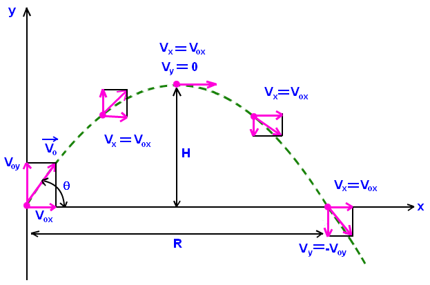

## Initial Concepts

* Projectile motion is a form of motion where an object or particle (called a projectile) moves in parabolic path.

* The path that the object follows is called its trajectory.

* The only force of significance that acts on the object is gravity, which acts downward to cause a downward acceleration. 

* There are no horizontal forces needed to maintain the horizontal motion - consistent with the concept of inertia.

* The only relevant quantities that might vary from projectile to projectile then are initial velocity and initial position.

--- .class #id 

## Equations

The equations below refer to a projectile which is launched in a $\theta$ angle with an initial non-zero velocity ($v_0$) from the zero initial position ($x_0=y_0=0$). The acceleration ($a$) is due to gravity alone, i.e., there is no horizontal component ($a_x=0$, $a_y=-g$).

<table>
  <tr>
    <td>
        Horizontal Direction
        $$x=x_0+v_{0x}t+\frac{1}{2}a_xt^2$$
        $$x=v_0(cos{\theta})t$$
        Vertical Direction
        $$y=y_0+v_{0y}t+\frac{1}{2}a_yt^2$$
        $$y=v_0(sin{\theta})t-\frac{1}{2}gt^2$$
    </td>

    <td>
        <center>
        
        </center>
    </td>

    <td>
        <b>Duration</b>
        $$t_{final}=\frac{2v_0sin\theta}{g}$$
        <b>Maximum Range given $v_0$ and $\theta$</b>
        $$R=v_0(cos{\theta})t_{final}$$
        <b>Maximum Height given $v_0$ and $\theta$</b>
        $$H=v_0(sin{\theta})\frac{t_{final}}{2}-\frac{1}{2}g({\frac{t_{final}}{2}})^2$$
    </td>

  </tr>
</table>

--- .class #id 

## Shiny Application

* The proposed application simulates the projectile motion based on the previous equations and given the parameters $g(m/s^2)$, $v_0(m/s)$, and $\theta(degrees)$.

* After entering the parameters you must press the submit button in order to simulate the trajectory of the projectile.

* Now, enjoy the simulation:
    + Keep $g$ and $v_0$ constant and check that the max range occurs at $45^{\circ}$. You can also verify that equal ranges occur for launch angles that exceed and fall short of $45^{\circ}$ by equal amounts (e.g. $40^{\circ}$ & $50^{\circ}$, $30^{\circ}$ & $60^{\circ}$, $0^{\circ}$ & $90^{\circ}$).
    + Keep $v_0$ and $\theta$ constant and verify the difference in range of a projectile launched from the surface of the Moon ($g{\approx}1.6m/s^2$) and another one launched from the surface of the Earth ($g{\approx}9.8m/s^2$).
    + Try other possibilities.

--- .class #id 

##  Code Example

* The shiny app uses three R functions based on the equations of slide 3.

```{r}
duration <- function(V, theta, g) 2 * V * sin(theta*pi/180) / g
horizontal <- function(V, theta, t) V * t * cos(theta*pi/180)
vertical <- function(V, theta, g, t) V * t * sin(theta*pi/180) - 1/2 * g * t^2

```

* Consider $g=9.8m/s^2$, $v_0=10m/s$, and ${\theta}=45^{\circ}$. We can calculate the duration ($t_{final}$), the maximum range ($R$) and the maximum height ($H$) of the parabolic trajectory.

```{r}
g <- 9.8; v0 <- 10; theta <- 45
tfinal <- duration(v0, theta, g)
paste("tfinal =", round(tfinal,2), "s ;", "R = ", round(horizontal(v0, theta, tfinal),2), "m ;", 
      "H = ", round(vertical(v0, theta, g, tfinal/2),2), "m")
```

